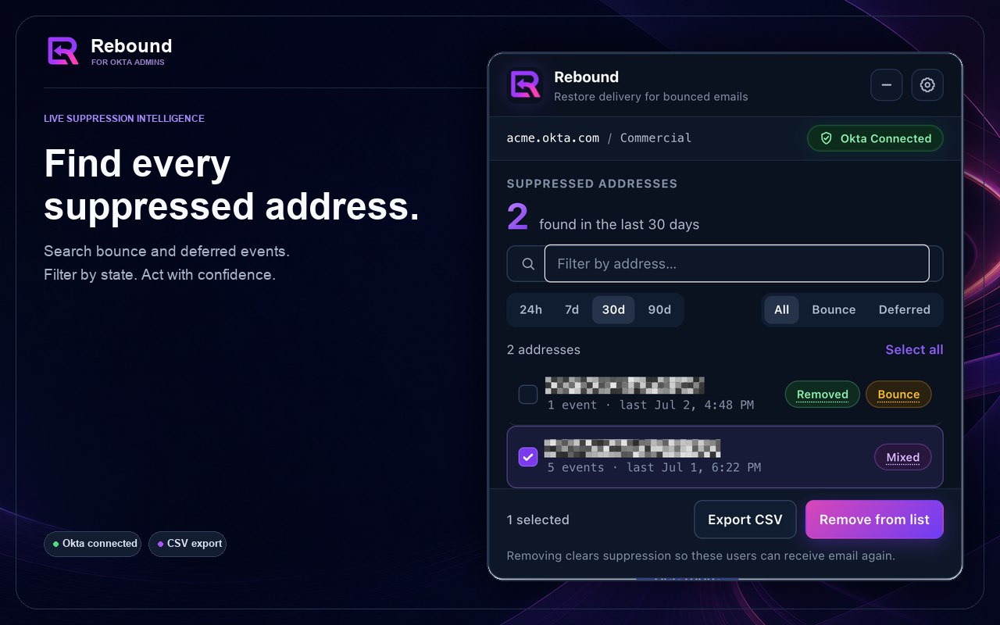
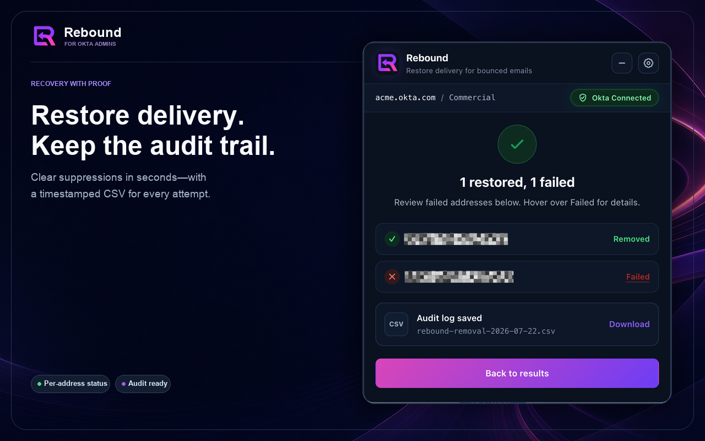
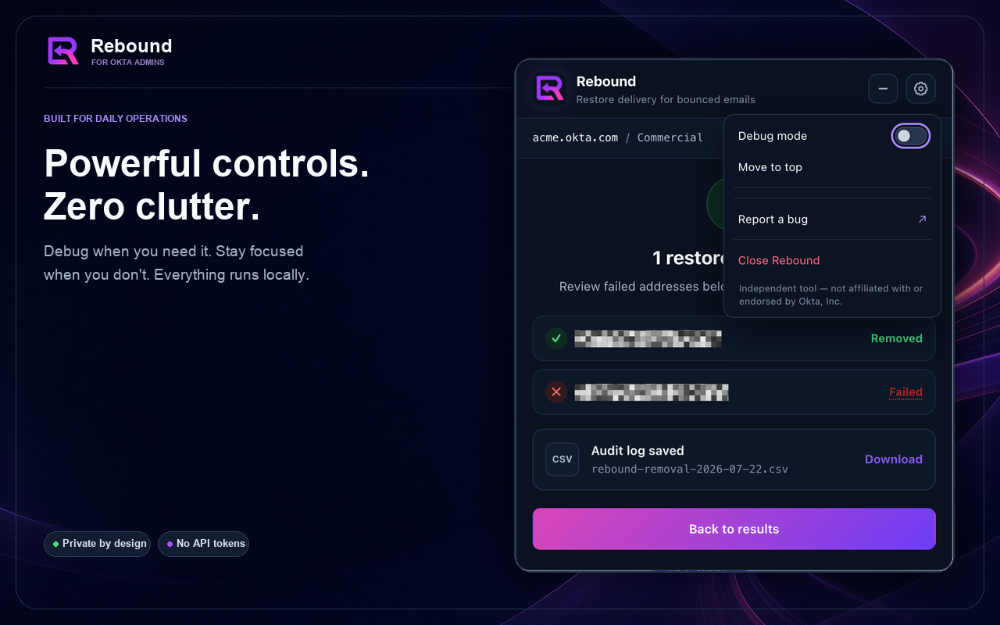

# Rebound — Bounce List Manager for Okta

Rebound is a lightweight browser extension that helps Okta administrators clear
bounced and deferred email addresses off the suppression list — directly inside
the Okta Admin Console — so affected users can receive email again.

> Rebound was previously released as **MOT v1**. Same functionality, redesigned UI.

<a href="https://chromewebstore.google.com/detail/rebound/occkoodcpkleecoccfdacopjokiejlkh"></a>

<sub>Also works on Microsoft Edge and other Chromium browsers.</sub>

## Current Release

```text
v1.3.0
```

## Features

### Bounce List Manager

- Search bounced email delivery events
- Search deferred email delivery events
- Filter results by address and by state (Bounce / Deferred)
- Remove selected addresses from the bounce suppression list
- Export search results to CSV
- Per-removal audit CSV (one row per address, with response request IDs)
- Tenant metadata + custom-domain detection
- API session validation ("Session valid" indicator)
- Debug Mode toggle

## The three views

- **Results & selection** — big count of suppressed addresses for the selected
  time window, an address filter, `24h / 7d / 30d / 90d` range and
  `All / Bounce / Deferred` state controls, and a selectable results list.
- **Removed + audit** — after a removal: per-address confirmation and a
  downloadable audit CSV (`rebound-removal-YYYY-MM-DD.csv`).
- **All clear** — friendly empty state when a search returns nothing, with the
  range control so you can widen the window and re-run.

## Project Page

https://github.com/noelmom/rebound

## Download

- **Chrome / Edge Web Store:** https://chromewebstore.google.com/detail/rebound/occkoodcpkleecoccfdacopjokiejlkh
- **Manual install:** grab the latest `rebound-<version>.zip` from the
  [Releases](https://github.com/noelmom/rebound/releases) page, then follow
  **Manual Installation** below.

## Screenshots







## Support

Bugs, feature requests, and questions are handled on GitHub:
https://github.com/noelmom/rebound/issues

## Security

_This section also serves as Rebound's privacy policy._

Rebound keeps tenant data inside your browser. It collects **no** personal
information, uses **no** analytics or trackers, and sends nothing to any
external server or third party.

**What Rebound accesses.** Using your already-authenticated Okta admin session,
Rebound reads bounced and deferred email delivery events from the Okta System
Log and, when you choose, submits bounce-list removals. All of this happens
directly between your browser and your own Okta tenant.

**What Rebound does NOT do:**

- Store credentials or API tokens
- Collect, sell, or share personal information
- Send tenant data, logs, metadata, search results, or CSV exports to a backend
- Use analytics, tracking, or third-party services

**Local storage.** Rebound saves only a few UI preferences (panel position,
minimized state, Debug Mode) locally in your browser. No account or tenant data
is stored.

All searches, processing, exports, and bounce-removal operations are performed
locally using the authenticated administrator browser session.

## Manual Installation

1. Download the latest Rebound ZIP package.
2. Extract the ZIP file.
3. Open `chrome://extensions` or `edge://extensions`.
4. Enable Developer Mode.
5. Click **Load unpacked**.
6. Select the extracted Rebound folder.
7. Log in to the Okta Admin Console.
8. Rebound opens automatically on supported admin URLs.

## Supported Admin Domains

```text
*.okta.com
*.oktapreview.com
*.okta-emea.com
*.okta-gov.com
*.okta.mil
```

## Release Notes

### v1.3.0

Enterprise UI refresh and event-history improvements.

Includes:

- New Rebound logo, toolbar icons, and dark enterprise interface
- Compact extension popup with a per-tab operations-panel toggle
- Recent-removal indicators with removal timestamps
- Bounce and deferred event-history tooltips
- Correct mixed Bounce / Deferred filtering with a compact Mixed state
- Concise failed-removal tooltips while preserving full audit details in CSV
- Improved connection, settings, debug toggle, and menu treatments
- Wider result rows with compact `5+ events` metadata
- Search-window consistency improvements for paginated System Log queries

### v1.2.1

Rebound release (redesign of MOT v1).

Includes:

- Bounce List Manager
- Bounce and deferred email search
- Address + state filtering
- Bounce removal with per-address audit CSV
- Search results CSV export
- Tenant metadata + custom domain detection
- API session validation
- Debug Mode toggle
- Rebound extension popup

## Roadmap

Planned future features:

- Bounce Removal History using `system.email.bounce.removal`
- Removal verification from System Log
- Rate Limit Inspector
- User Lookup Helper
- System Log Query Builder

## Disclaimer

Rebound is an independent tool and is not affiliated with, endorsed by, or
sponsored by Okta, Inc. "Okta" and related marks are trademarks of Okta, Inc.,
used here only to describe compatibility.

## License

Released under the [MIT License](LICENSE).

Copyright © 2026 Noelmo Melo.
