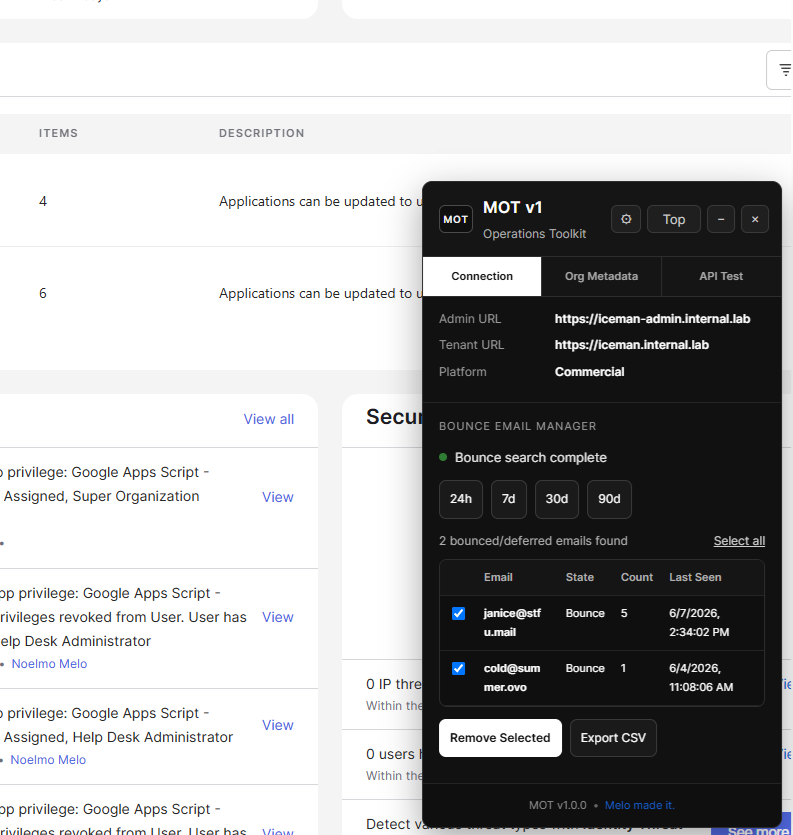

# MOT v1 — Melo Operations Toolkit

MOT v1 is a lightweight browser extension that provides operational tools directly inside the Okta Admin Console.

## Current Release

```text
v1.0.0
```

## Current Feature

### Bounce Email Manager

MOT v1 helps administrators:

- Search bounced email delivery events
- Search deferred email delivery events
- Remove selected email addresses from the bounce list
- Export search results to CSV
- Export per-email removal confirmation to CSV
- View tenant metadata
- Validate admin API session access

## Project Page

https://github.com/noelmom/mot

## Download

https://github.com/noelmom/mot/releases/tag/v1.0.0

Chrome/Edge:
https://chromewebstore.google.com/detail/mot-v1/occkoodcpkleecoccfdacopjokiejlkh

## Screenshots



## Support

- Bug Report: https://forms.gle/41a3QX4bXD2C4ikC6
- Feature Request: https://forms.gle/KUsk1PZ3D2YwDsmU6
- Contact / Support: https://forms.gle/5pp1ZzU6zP5gYvBx9

## Security

MOT does not transmit tenant data outside of the browser.

MOT does not:

- Store credentials
- Store API tokens
- Send tenant data to external services
- Send logs, metadata, search results, or CSV exports to a backend

All searches, processing, exports, and bounce removal operations are performed locally using the authenticated administrator browser session.

## Manual Installation

1. Download the latest MOT v1 ZIP package.
2. Extract the ZIP file.
3. Open `chrome://extensions` or `edge://extensions`.
4. Enable Developer Mode.
5. Click **Load unpacked**.
6. Select the extracted MOT folder.
7. Log in to the Okta Admin Console.
8. MOT opens automatically on supported admin URLs.

## Supported Admin Domains

```text
*.okta.com
*.oktapreview.com
*.okta-emea.com
*.okta-gov.com
*.okta.mil
```

## Release Notes

### v1.0.0

Initial public release.

Includes:

- Bounce Email Manager
- Bounce and deferred email search
- Bounce removal
- Per-email removal audit CSV
- Search results CSV export
- Tenant metadata detection
- Custom domain detection
- API session validation
- Debug Mode toggle
- MOT extension popup
- MOT toolbar icons
- Project page/support links

## Roadmap

Planned future features:

- Bounce Removal History using `system.email.bounce.removal`
- Removal verification from System Log
- Rate Limit Inspector
- User Lookup Helper
- System Log Query Builder

## Copyright

Copyright © 2026 Noelmo Melo.

All rights reserved.
